# Quantifying Clipping Softness

We present a formal description of clipping functions and a method to analyze their softness mostly audio applications (guitar electronics, audio DSP, etc.) in mind. We also present the softest clipping function, the Blunter, and report the results of an experiment showing that it is indeed the softest function given our description of clipping softness. 

## Introduction

Clipping is a fundamental concept in signal processing. In high fidelity applications it may be an undesirable artifact of limited headroom and/or failed gain staging, but it can also be an intentional creative effect like in guitar electronics or some music production gear. Either way, the clipping softness has major implications how it is perceived. 

There are multiple studies about non-linear distortions in audio that include some analysis of hard and soft clippers. Some focus on detecting these kinds of distortions[^1][^2], others focus on how these distortions are perceived[^1][^3][^4]. However, these studies only use soft clippers as a part of their study, which is not directly about softness. In other words, these studies have not studied clipping softness itself in detail. 

Hard clipping is commonly described as follows: once a signal reaches some threshold it cannot exceed that threshold and will be abruptly cut as shown in Figure 1 (a). There is not much ambiguity regarding to this type of clipping. A soft clipper, on the other hand, is commonly described as a type of clipping where the signal level may keep increasing after the threshold is reached when increasing the input signal level as shown in Figure 1 (b). However, there are few ambiguities in this definition of soft clipping: the threshold of clipping, the upper limit of clipping, and how the signal transforms from the threshold to to the limit. Many clippers do not have a well defined threshold nor they have a well defined limit like $\text{arcsinh}$. Even if they do, it is still unclear how abruptly the clipper reaches from the threshold to the limit. 

    

        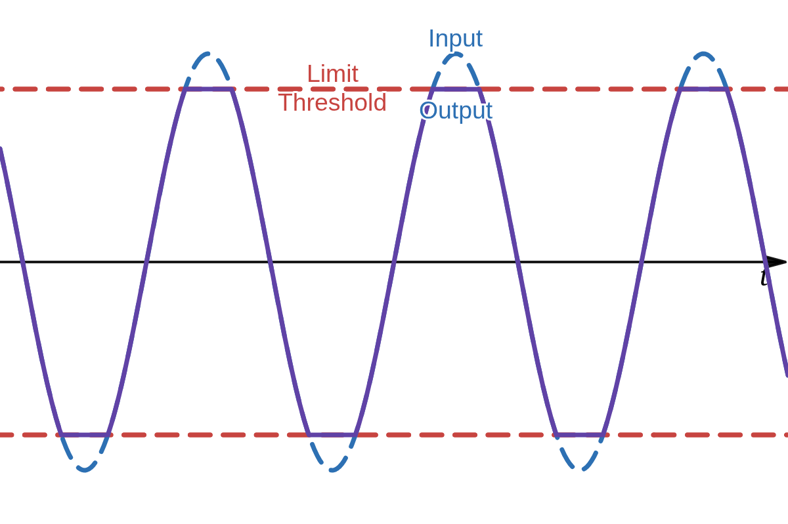
        <b>(a)</b> Hard clipping
    

    

        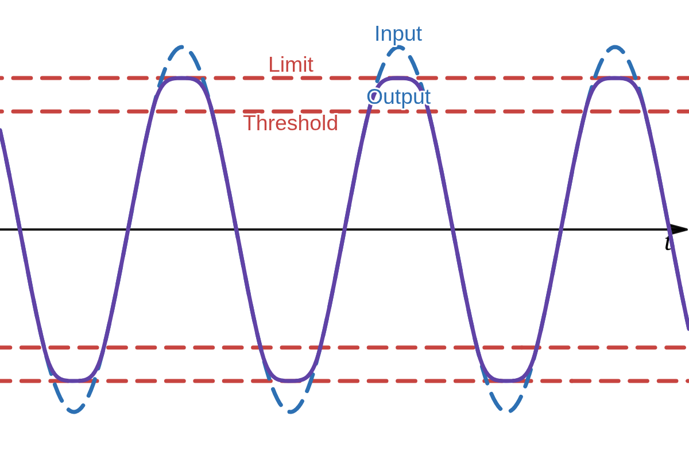
        <b>(b)</b> Soft clipping
    

    

        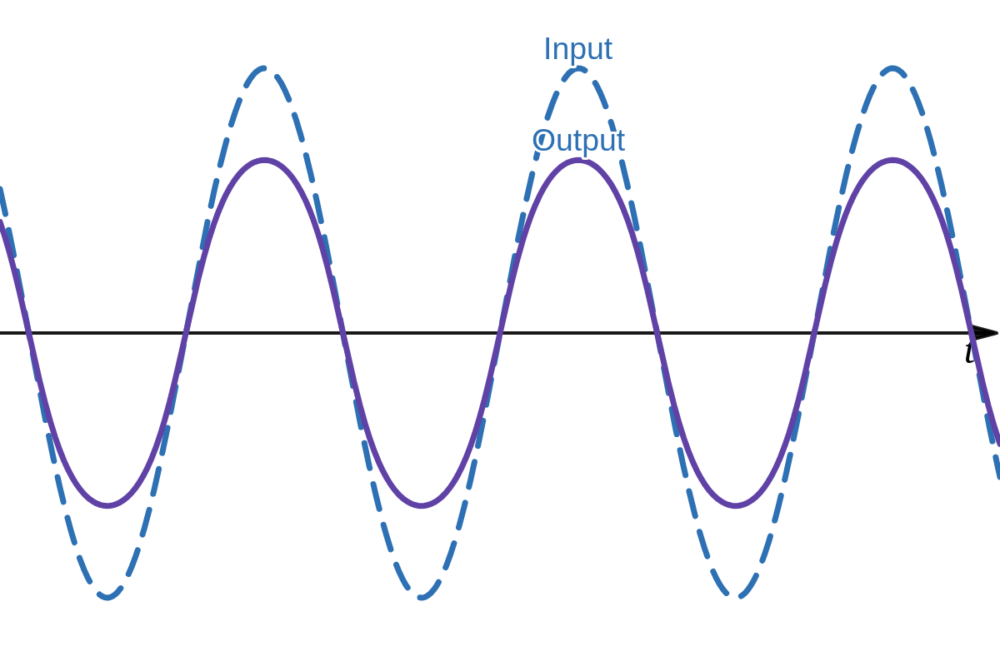
        <b>(c)</b> Arctan soft clipping
    

    

    	<b>Figure 1:</b> Comparison of three clipping types. (a) has unambiguous limit/threshold. The threshold in (b) would not be immediately clear if we didn't show it. In fact, it is only known because we happened to use a soft clipper with a well defined threshold. However, where is the limit and threshold in (c)?
    

Furthermore, the value for the hypothetical threshold and limit changes as the gain of the input signal changes and/or the gain of the output signal changes. All real world systems have these parameters, often given by the designer (like guitar amplifier gain and volume controls) of the system, but sometimes they are implicit to the system. For example, an implicit output gain could be given by the choice of components in an electronic circuit and implicit input gain could be given by the loudness of a singer singing into a microphone. This leads to yet another question: how would you compare the clipping softness of systems with varying input and output gain characteristics? 

Our model deals with the threshold and limit ambiguities by analyzing the second derivative of the clipping functions instead of analyzing some hypothetical thresholds and limits. The second derivative describes exactly how abruptly the changes in the input signal change with increasing input signal levels. We will also look at an alternative definition of softness based on change of higher order harmonics as input amplitude increases and present methods to normalize input and output gains to enable meaningful comparison of different clipper functions. 

But before anything, we perform a quick review of any relevant background information. The reader is assumed to have some understanding about these topics, but the main purpose of the review is to frame the information in a way that suits our problem. 

## Background Review

A periodic signal $x(t)$ can be represented by a sum of sinusoids (**Fourier series**): 
$$
x(t) = \frac{a_0}{2} + \sum\limits_{n = 1}^{\infty} \left(
		a_n \cos \left(\frac{2\pi}{T} nt \right) 
		+ b_n \sin \left(\frac{2\pi}{T} nt \right)
	\right),
$$
where $T$ is the period of the signal and $2\pi n / T$ is the frequency of each harmonic. $a_n$ and $b_n$ are the Fourier coefficients for the harmonics. The DC offset $a_0 / 2$ is not important for us and we will ignore it for the most part. $a_n + b_n$ together can be used to represent the phase of any given harmonic and the amplitude of that harmonic can be computed using $\sqrt{a_n^2 + b_n^2}.$ Each Fourier coefficient can be computed like so: 
$$
\begin{align}
a_n &= \frac{2}{T} \int\limits_0^T x(t)\cos \left( \frac{2\pi}{T}nt \right) \,dt \label{a} \\
b_n &= \frac{2}{T} \int\limits_0^T x(t)\sin \left( \frac{2\pi}{T}nt \right) \,dt \label{b}
\end{align}
$$
Clipping a pure sinusoid generates harmonics. A common way of measuring overall distortion of a system is to feed a sinusoid to it and measure the amplitudes of the generated harmonics relative to the fundamental. This is known as **THD** (**total harmonic distortion**), and it can be computed using the Fourier coefficients like so: 
$$
\begin{equation}
\text{THD} = \sqrt{ \frac{\sum_{n=2}^{\infty} (a_n^2 + b_n^2)}{a_1^2 + b_1^2} }. \label{thd}
\end{equation}
$$

## Definitions

### Clipping Function

A **clipping function** $f$  (or **clipper**) shall be any function that is non-linear, differentiable, and monotonically increasing. Clipping is a form of wave shaping, so it must be non-linear by definition. Monotonicity rules out wave folding effects, the function's output must not change when increasing input beyond it's limits. Additionally, $f'$ shall be unimodal (bell shaped) and nonnegative for all real inputs. This means that $f$ must be a *Sigmoid*-shaped function. 

For any meaningful analysis the clipping function must be normalized. For any clipping function $f,$ a **normalized clipping function** is defined as 
$$
f_1(x) = A_\text{out} f(A_\text{in} x),
$$
where $A_\text{in}$ is the **input gain** and $A_\text{out}$ is the **output gain**. Normalization is discussed later in more detail. 

Clippers can be categorized in three categories: 

- **Bounded** clippers cannot increase their output once some limit is reached. In other words, bounded clippers are piece-wise functions that have zero derivative beyond any given signal level limit. 
- **Converging** clippers have a limit when signal level approaches infinity. 
- **Diverging** clippers do not converge. Output signal level can be increased indefinitely. 

Asymmetric clippers can be any combination of these categories for each side of the waveform. 

Real-world clippers seen in music production gear often have a non-flat frequency response and non-zero phase response[^10]. This complicates any attempts to analyze softness significantly: any results will be frequency dependent. However, analyzing the non-linearities isolated from any linear effects is often preferred anyway for meaningful comparisons. Measuring a hard clipper processed with a steep low pass filter to be softer than a soft clipper processed with a high pass filter doesn't seem like a very useful result. Therefore, we will be assuming flat frequency response and zero phase if not stated otherwise. 

### Hardness and Softness

Clipping **hardness** $H_f$ and **softness** $S_f$ of any given clipping function can be defined as 
$$
\begin{align}
H_f	&= \max(|f_1''(x)|) \label{hardness0} \\
S_f	&= \frac{1}{H_f}. \label{softness}
\end{align}
$$
The maximum absolute value of the second derivate describes how abruptly the change of a signal changes. It is  analogous to acceleration in kinematics. We only care about it's magnitude. Using $\max$ is a deliberate simplification of the model; only the largest local extreme is considered regardless of side of the $x$ axis or number of local extrema. Real world clippers may be (and commonly are) asymmetric, and they might have multiple local extrema, which might be the case when composing clippers. We think that the simplification is justified: it can be expected that the sharpest edge of the clipping function dominates the abruptness of change in harmonic content. We also expect our model to be predominantly used for individual clippers that are usually unimodal instead of multi-modal composed clippers. We will also simplify the study further by focusing on symmetric clippers for brevity. 

If $g(x) = h(kx),$ where $k$ is constant, then the chain rule gives us 
$$
\begin{align*}
g'(x)  &= k h'(k x) \\
g''(x) &= k^2 h''(k x),
\end{align*}
$$
which allows us to determine hardness in terms of unnormalized clippers like so: 
$$
\begin{equation}
H_f = A_\text{out} A_\text{in}^2 \max(|f''(A_\text{in} x)|). \label{hardness1}
\end{equation}
$$

While $A_\text{in}$ moves the extrema in the x-axis, it won't change $\max(|f''(A_\text{in}x|),$ so $\eqref{hardness1}$ can be simplified to 
$$
\begin{equation}
H_f = A_\text{out} A_\text{in}^2 \max(|f''(x)|). \label{hardness}
\end{equation}
$$

### WTHD Hardness

The THD is not a good measure of how distorted an audio signal is perceived to be. For example, it completely ignores the fact that higher order harmonics are perceived more strongly and offensively[^4]. A simple heuristic to accommodate for the perception of the higher order harmonics is to weight the harmonics' amplitudes linearly. We define **weighted total harmonic distortion** (**WTHD**) to be 
$$
\text{WTHD} = \sqrt{ \frac{\sum_{n=2}^{\infty} n (a_n^2 + b_n^2)}{a_1^2 + b_1^2} }. \label{wthd}
$$
If we feed a sinusoid to a clipper, as the input amplitude of the input sinusoid changes, so does the the Fourier coefficients, and thus the WTHD as well. So the WTHD of a clipper can be described as a function of input amplitude: 
$$
\begin{equation}
\text{WTHD}_f(\alpha) = \sqrt{ \frac{
	\sum_{n=2}^{\infty} n (a_{fn}(\alpha)^2 + b_{fn}(\alpha)^2)}
	{a_{f1}(\alpha)^2 + b_{f1}(\alpha)^2} }, \label{wthdf}
\end{equation}
$$
where $\alpha$ is the changing input amplitude and 
$$
\begin{align}
a_{fn}(\alpha) &= \frac{2}{T} \int\limits_0^T 
	f \left( A_{\text{in}} \alpha \sin \left( \frac{2\pi}{T}t \right) \right) 
		\cos \left( \frac{2\pi}{T}nt \right) \,dt \nonumber \\
b_{fn}(\alpha) &= \frac{2}{T} \int\limits_0^T 
	f \left( A_{\text{in}} \alpha \sin \left( \frac{2\pi}{T}t \right) \right) 
		\sin \left( \frac{2\pi}{T}nt \right) \,dt \label{b_fn}
\end{align}
$$
are the Fourier coefficients produced by feeding a sinusoid to $f.$ As noted earlier, it is often a good idea to assume zero phase. In that case, $f(A_\text{in}\alpha\sin(2\pi t/T))$ is an *odd function* and $\cos(2\pi nt/T)$ is an *even function*, and therefore, integrating their product would yield $a_{fn}(\alpha) = 0.$ This would simplify $\eqref{wthdf}$ to 
$$
\begin{equation}
\text{WTHD}_f(\alpha) 
	= \frac{\sqrt{\sum_{n=2}^\infty nb_{fn}(\alpha)^2}}{b_{f1}(\alpha)}. \label{wthdf0}
\end{equation}
$$
Since hardness is supposed to measure how the signal changes, we can use the derivative of $\eqref{wthdf}$ or $\eqref{wthdf0}$ for an alternative definition of hardness. We will define the **WTHD hardness** and **WTHD softness** to be 
$$
\begin{align*}
H_{\text{WTHD}f} &= \max(\text{WTHD}_f'(\alpha)) \\
S_{\text{WTHD}f} &= \frac{1}{H_{\text{WTHD}f}}.
\end{align*}
$$
This potentially more accurately would match the perception of softness. By measuring the change in WTHD, we are measuring how the clipping "feels". For example, an electric guitar player playing trough a hard clipper with low input gain might note that playing softly enough results in no distortion and playing harder immediately produces noticeable higher order harmonics. 

The problem with this definition is that computing it for arbitrary functions would require computing the Fourier series repeatedly and observing how the WTHD changes. This could be computationally very expensive, so we will focus on the second derivative based definition instead. However, we will see later that the second derivative based and the WTHD based definitions are related to each other. 

Note that $A_\text{out}$ is nowhere to be seen in this definition. This is because $A_\text{out}$ is not needed for this definition: WTHD is already normalized against the amplitude of the output fundamental. 

We will be referring to non-WTHD (second derivative based) hardness as just hardness, WTHD is explicitly stated when referring to WTHD hardness from now on. 

## Hard Clipper and Quadratic Soft Clipper

Our model is already powerful enough to do analysis of **hard clipper** $h.$ Hard clipper is a special case that does not need to be normalized to determine it's hardness and softness, so we will set it's input and output gains to one. We only need to consider the other side of the waveform for this analysis, we will use the positive side. A hard clipper will be linear until a threshold $T$ is reached after which the output stays constant. We will set this threshold to one. Then, a positive side hard clipper can be described as 
$$
h_+(x) = \begin{cases}
		x, & x \le 1 \\
		1, & x \ge 1.
	\end{cases}
$$
A hard clipper is not differentiable, and thus, not a valid clipping function on it's own. However, we can approximate it using a **quadratic soft clipper** $s,$ which also has a clipping threshold, but it has a variable knee size $k \in (0, 1].$ A knee with zero size would be equivalent of not having a knee at all, which would be hard clipping. This soft clipper is linear below $T - k,$ constant above $T + k,$ and uses quadratic spline $P$ to interpolate smoothly between $T - k$ to $T + k.$ The resulting function is a valid clipping function, however we are only using it to analyze hard clipping, so we will ignore normalization. Then, a positive side soft clipper can be described as 
$$
\begin{align}
P(x) &= ax^2 + bx + c \nonumber \\
a    &= -\frac{1}{4k} \nonumber \\
b    &= \frac{1}{2} + \frac{T}{2k} \nonumber \\
c    &= -\frac{T^2}{4k} + \frac{T}{2} - \frac{k}{4} \nonumber \\
s_+(x) &= \begin{cases}
		x,		& x \le 1 - k \\
		P(x),	& 1 - k \le x \le 1 + k \\
		1,		& 1 + k \le x.
	\end{cases} \label{qsoft}
\end{align}
$$
It is trivial to see that the maximum of the second derivative of the soft clipper is completely determined by the spline. We can also see that 
$$
H_{s+} = \max(-s_+''(x)) = \max(-a) = \frac{1}{4k},
$$
so the hardness of $s$ is completely determined by $k$ and the limit of hardness and softness of the soft clipper as the knee size approaches to hard clipping is 
$$
\begin{align*}
H_h &= \lim_{k \to 0+} \frac{1}{4k} = \infty \\
S_h &= \lim_{k \to 0+} \frac{1}{H_h} = 0,
\end{align*}
$$
which seems rather intuitive. A similar reasoning can probably be applied to observe that $\lim H_{\text{WTHD}h} = \infty$ as well. We leave this analysis as an exercise to the reader. 

The analysis for negative side would be identical of course. However, it should be noted that asymmetrical hard clipping will always have a softness of zero, regardless of clipping thresholds of either side. In fact, the other side may not be clipped at all and the result is still zero. This may seem confusing and like it could undermine the usefulness of the model. And indeed, fully asymmetrical (one side linear) clipping will have a very distinct sound from symmetrical clipping. However, both asymmetrical and symmetrical hard clipping have an important property: once a threshold is reached (doesn't matter which one or both), the sound is immediately notably distorted. The abruptness of the clipping is what softness is measuring, a complete description of tonal characteristics of any given clipping function is outside of the scope of this study. 

While we only needed to consider simplified unipolar hard clipper and soft clipper, their complete descriptions can be useful for DSP or other purposes. So for completeness, the full generic description of asymmetric hard clipper and quadratic soft clipper is as follows: 
$$
\begin{align*}
h(x) &= \begin{cases}
		T_-, & x \le T_- \\
		x,   & T_- \le x \le T_+ \\
		T_+, & T_+ \le x
	\end{cases} \\

P_+(x) &= -\frac{1}{4k_+}x^2 
			+ \left( \frac{1}{2} + \frac{T_+}{2k_+} \right)x 
			+ \left( -\frac{T_+^2}{4k_+}+\frac{T_+}{2}-\frac{k_+}{4} \right) \\

P_-(x) &= \frac{1}{4k_-}x^2 
			+ \left( \frac{1}{2} - \frac{T_-}{2k_-} \right)x 
			+ \left( \frac{T_-^2}{4k_-}+\frac{T_-}{2}+\frac{k_-}{4} \right) \\

s(x) &= \begin{cases}
		T_-,     & x \le T_- - k_- \\
		P_-(x), & T_- - k_- \le x \le T_- + k_- \\
		x,		& T_- + k_- \le x \le T_+ - k_+ \\
		P_+(x),	& T_+ - k_+ \le x \le T_+ + k_+ \\
		T_+,	& T_+ + k_+ \le x,
	\end{cases}
\end{align*}
$$
where $T_- < 0,$ $T_+ > 0,$ $k_- \in (0, -T_-],$ and $k_+ \in (0, T_+].$ Symmetric hard and soft clippers are simpler: 
$$
\begin{align*}

h(x) &= \begin{cases}
		x, & |x| \le T \\
		T \, \text{sign}(x), & |x| \ge T
	\end{cases} \\

P(x) &= -\frac{1}{4k}x^2 
		+ \left( \frac{1}{2} + \frac{T}{2k} \right)x
		+ \left( -\frac{T^2}{4k}+\frac{T}{2}-\frac{k}{4} \right) \\

s(x) &= \begin{cases}
		x, & |x| \le T - k \\
		\text{sign}(x)P(|x|), & T - k \le |x| \le T + k \\
		T\,\text{sign}(x), & T + k \le |x|,
	\end{cases}

\end{align*}
$$
where $T > 0$ and $k \in (0, T].$ 

## Normalization

The input gain controls the amount of clipping distortion. Input gain affects the output level, but output gain does not affect the amount of distortion, so input gain must be normalized before output gain normalization. Input gain will be normalized by setting it to a value such that measuring the THD of the clipping functions result to same normalized THD value. Again, to measure the amplitudes of the Fourier coefficients for our THD measurement, we need to pass a sinusoid to our clipper, so in our case $\eqref{a}$ and $\eqref{b}$ will be 
$$
\begin{align}
a_n &= \frac{2}{T} \int\limits_0^T 
	f \left( A_{\text{in}} \sin \left( \frac{2\pi}{T}t \right) \right) 
		\cos \left( \frac{2\pi}{T}nt \right) \,dt \nonumber \\

b_n &= \frac{2}{T} \int\limits_0^T 
	f \left( A_{\text{in}} \sin \left( \frac{2\pi}{T}t \right) \right) 
		\sin \left( \frac{2\pi}{T}nt \right) \,dt, \label{b_n}
\end{align}
$$
but once again, assuming zero phase, we get $a_n = 0$ and a simplified THD of 
$$
\text{THD}_f = \frac{\sqrt{\sum_{n=2}^{\infty} b_n^2}}{b_1}.
$$
It should also be noted that symmetric clippers will not produce any even harmonics[^5]. This is not necessarily important for our analysis, but it is useful to know to decrease computation time when applicable. 

The value of THD normalization will affect softness. Consider bounded clippers: given a periodic input, large amounts of input gain would make the output to converge to a square wave with well defined amplitude. But for diverging clippers (like $\text{arcsinh}$), the output does not necessarily resemble a square wave as closely with large amounts of input gain making it sound softer. With lower gains, however, $\text{arcsinh}$ has more noticeable clipping threshold, which is described well by the extreme of the second derivative. We will be focusing on more modest input gains (e.g. potentially used by mixing engineers and semi-clean electric guitar tones) in this study. Softness anyway has a more profound effect with lower gains since higher gains transform any periodic input to an approximated square wave. 

The output gain controls the overall volume. It does not change the clipping characteristics, but the hardness (the second derivative) is directly proportional to it, so it must be normalized. It will be normalized by total power of the clipping function given some signal, which is commonly described by **root mean square** (**RMS**): 
$$
\text{RMS} = \sqrt{ \frac{1}{t_1 - t_0} \int_{t_0}^{t_1} x(t)^2 \,dx }.
$$

The issue with RMS is that it is also affected by DC, which would affect hardness too despite being inaudible. We need to use the **standard deviation** $\sigma$ instead, which subtracts the DC from the signal. The standard deviation is defined as 
$$
\begin{equation}
\sigma = \sqrt{ \frac{1}{t_1 - t_0} \int_{t_0}^{t_1} (x(t) - \mu)^2 \,dx }, \label{stddiv}
\end{equation}
$$
where 
$$
\mu = \frac{1}{t_1 - t_0} \int_{t_0}^{t_1} x(t) \,dx
$$
is the DC offset or the **mean** of the signal. Since the DC is inaudible but affects headroom, it is commonly filtered out before any clipping happens. Furthermore, symmetric clippers do not introduce any DC offset, so it is common to have $\mu = 0.$ In those cases, $\text{RMS} = \sigma.$ 

We must choose an input signal for the measurement. It might be tempting to use a sinusoid, since that is what we needed to use to measure and normalize input gain, but the problem with that is that real world audio is rarely just a pure sinusoid. Furthermore, passing $\sin(t) \in [-1, 1]$ will only only consider $f$ in a limited domain of $[-1, 1]$ ignoring anything beyond this domain. Consider clippers $\arctan(x)$ and $\arctan(h(x)).$ If the input signal is limited to $[-1, 1],$ then (depending on THD normalization value) these clippers might result in an identical output gain normalization value. The hard clipping on the latter clipper would be completely ignored. 

We need a signal that is roughly an average of all signals in some sense. A good candidate could be *Gaussian noise*, which has a **probability mass function** that follows the normal distribution. The **probability mass** describes how likely it is for a sample to get a specific value[^6]. This is important for us, because we need heuristics to determine how our clipping function would transform any given input values to output values on average. Since we cannot know our input signals, a probabilistic approach seems appropriate. 

Gaussian noise does have one huge issue for practical measurements: we would need to generate a huge amount of samples of it in order to converge. This could be done using any pseudo-random number generator with uniform distribution and *Box-Muller transform*[^7], but it would require huge amount of processing before it gets useful due to reliance of statistical convergence. Luckily, we don't need Gaussian noise, we just need anything that will give us a similar probability mass. It turns out that sampling the quantile function of any given distribution enough times at regular intervals will yield the corresponding probability mass[^8]. This means that as our signal we can use the quantile function of a Gaussian called the **probit** function, which can be computed using 
$$
\text{probit}(t) = \sqrt{2} \text{erf}^{-1}(2t - 1),
$$
where $t \in (0, 1)$ and $\text{erf}^{-1}$ is the inverse of the error function. So finally, using $\eqref{stddiv}$, we get our output gain normalization: 
$$
\begin{align}
\sigma_f   &= \sqrt{ \int_0^1 f(A_\text{in} \text{probit}(t))^2 \,dt } \label{f_rms} \\
A_{\text{out}} &= \frac{1}{\sigma_f} \label{out_gain}
\end{align}
$$

A great property of $\text{probit}$ is that $\lim_{t\to 0} \text{probit}(t) = -\infty$ and $\lim_{t\to 1} \text{probit}(t) = \infty.$ This means that the clipping function will considered in it's full domain (unlike when normalizing input gain), which is especially useful for composed clippers. 

## The Blunter

There exists a symmetric clipper that is softer than any other symmetric clipper for a range of THD normalization values, which we will call **the Blunter**. We will be referring to it quite a lot, so it worth defining and naming it. The unnormalized Blunter is defined as 
$$
\begin{align*}
B(x) &= \begin{cases}
		2x - |x|x,      & |x| \le 1 \\
		\text{sign}(x), & |x| \ge 1
	\end{cases} \\
	&= \begin{cases}
		-1,       & x \le -1  \\
		2x + x^2, & -1 \le x \le 0 \\
		2x - x^2, & 0 \le x \le 1 \\
		1,        & 1 \le x.
	\end{cases}
\end{align*}
$$
The normalized Blunter is 
$$
B_1(x) = A_{B\text{out}} B(A_{B\text{in}} x).
$$
The Blunter is equivalent to our quadratic soft clipper when knee $k = T$ the only difference being normalization constants, so again, it's hardness is determined by the polynomial. Using $\eqref{hardness}$ and $|(x - 2x^2)''| = 2,$ the hardness of the Blunter is 
$$
H_B = 2 A_{B\text{out}} A_{B\text{in}}^2.
$$
A way to interpret the constant second derivative of the polynomial part is to imagine a peaky local extreme in the second derivative and spread it out as evenly and as widely as possible. This would mean that for any other clipper to be softer, they would have to have their extrema spread out even more evenly and widely, which should be only possible if the THD normalization value is low enough (diverging clippers are expected to be softer for high THD normalization values since they are not limited). This would mean that a hardness that is smaller than $H_B$ would most certainly indicate that either the input gain, the output gain, or both are unnormalized. This is a bit difficult to prove analytically, but it can be experimentally shown that Blunter is indeed the softest clipper. 

## Finding the Softest Clipper

We provide a repository[^9] that contains code for multiple experiments and tests for this study. The main experiment in `src/smoothest.c` generates all potential symmetric clipping functions with given precision `BASE`. For each of the generated functions, a normalized input gain and output gain is calculated to finally find the hardness of the function. Finally, the function with minimum hardness is found. Names `f` and `f_*` refer to clipping function lookup-tables. 

### Counter

An algorithm was developed that generates all potential symmetric clipping functions given a discrete precision of `BASE`. The basic idea is based on a counter: take `BASE` number of digits and start counting in that `BASE`. The generated sequence of numbers will be represent the positive side of a clipping function as a lookup table. By counting all numbers, we can ensure that each clipping function has in fact been generated. However, this naïve approach would have a time complexity of $O(\text{n}^\text{n}),$ where $n = \text{BASE},$ so we need to find a way of skipping as many counts as possible. Our counting algorithm exploits clippers monotonicity and unimodal derivative to reduce counts. 

An important concept for our algorithm is **flushing**. It is demonstrated in Figure 2 and can be described as follows: Knowing that the first derivative of a valid clipping function must be greater than or equal to zero, each time we increment a digit in the middle to a value that is greater than the digit on it's right side, we can duplicate the incremented digit to all of the digits on the right side (flush). Of course, a real counter would only increment digits in the middle when carrying, but the concept of flushing is important for us. 

    

        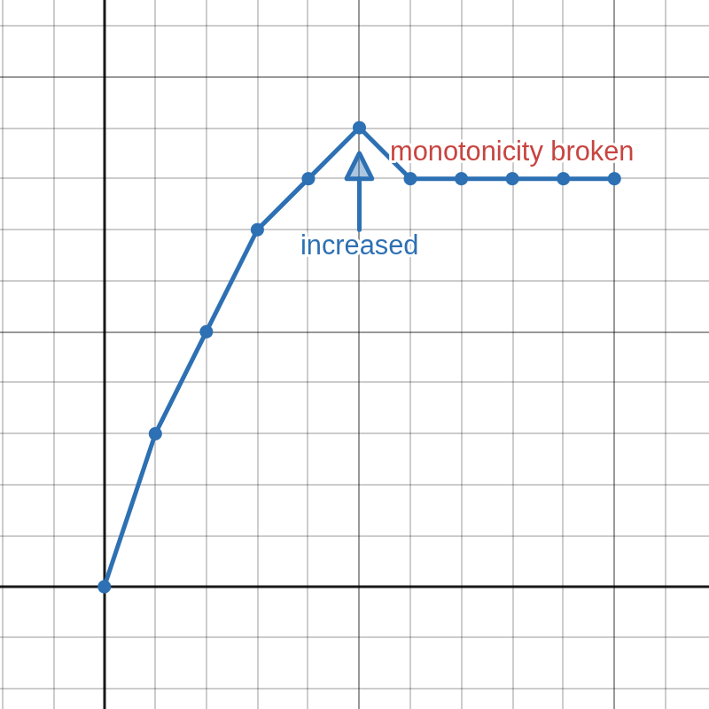
        <b>(a)</b> Cannot increment just this one. 
    

    

        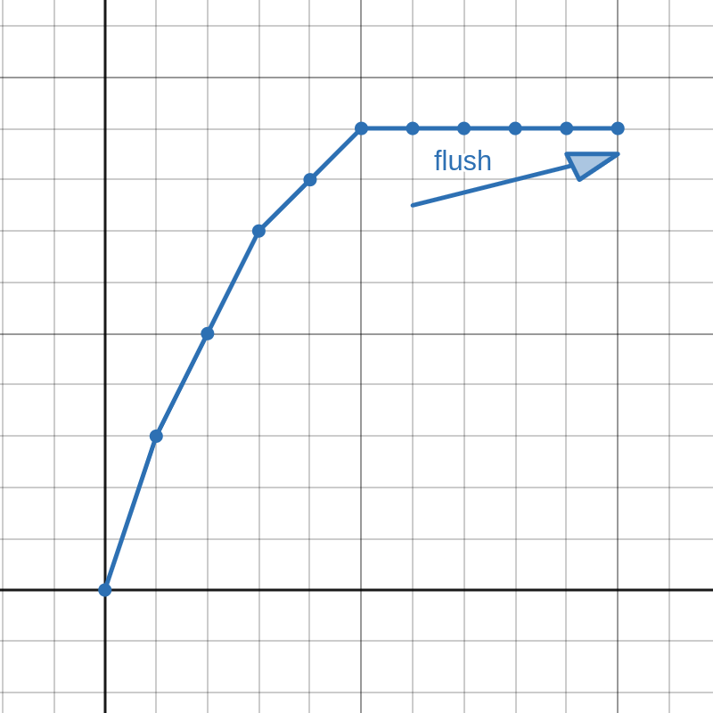
        <b>(b)</b> Have to increment all these. 
    

    

    	<b>Figure 2:</b> This could be the output of the counter at some point when counting in BASE=10. (a) shows how increasing a value in the middle breaks monotonicity, so we have to add one to each point on the right as well, which will give us (b). 
    

Since the counter only generates the positive side, it's output has to be duplicated to the negative side. In our implementation, the actual duplication is done later in the processing chain, but our counter has to take it into account anyway. To preserve symmetry on duplication, the digit at index zero must be fixed to zero. Also, given unimodal derivative, the derivative at index zero must be non-zero. This means that the counter must count from index one, and we count each digit from one to `BASE` instead of zero to `BASE-1` like a regular counter. Given these constraints, our counting algorithm can be described as follows: 

1. Initialize the counter: the digit at index zero shall be set to zero, the rest shall be set to one. 
2. Knowing that the first derivative is unimodal, we can deduce that the first derivative is also monotonically decreasing on the positive side, so we can skip all increments from the right that would increase the derivative from zero to one. Flush from the next digit on the right of the first digit with non-zero derivative. 

    

        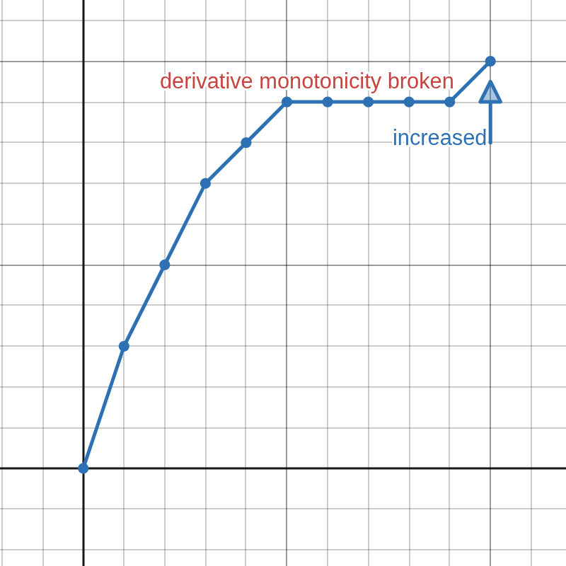
        <b>(a)</b> Cannot increment just this one. 
    

    

        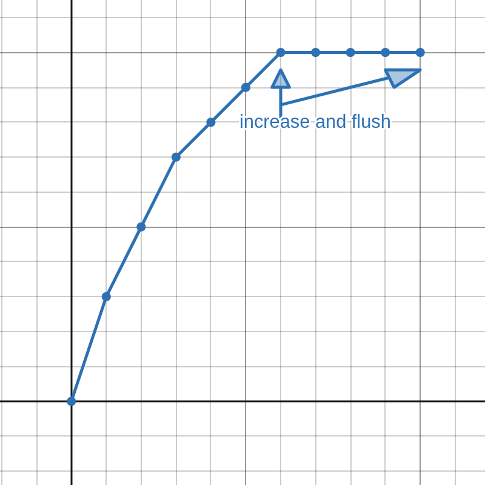
        <b>(b)</b> Have to increment all these. 
    

    

    	<b>Figure 3:</b> To preserve monotonicity of the derivative, one must increment from the leftmost point where the derivative is zero. 
    

3. The next few functions can be obtained by incrementing and flushing the next digits on the right by using reasoning from Step 2. The index for flushed digit can be cached to keep track where to flush next. Increment and flush until the digit equals `BASE` or until the index equals `BASE`. 

    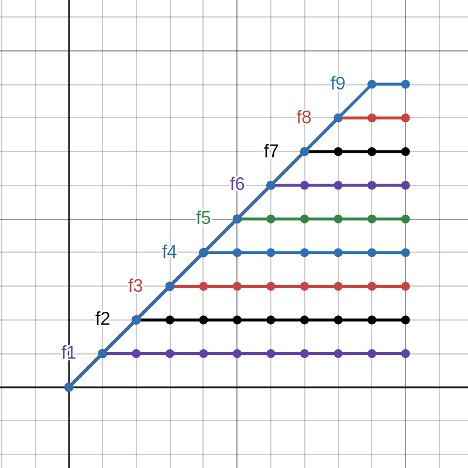
    

    	<b>Figure 4:</b> Step 3 applies Step 2 repeatedly. Here we show how Step 3 is applied nine times to produce the first nine clippers of the sequence. 
    

4. Since we are conceptually counting numbers here, once a to-be-incremented digit equals `BASE`, the digit from the left must be incremented. However, the first derivative is known to be decreasing, we can only increment the leftmost digit of a segment with same derivative—increasing any digit on the right side would increase the derivative, so find where the derivative changes and increment that. Normally when counting, incrementing a digit would zero all digits on the right side, but this would break monotonicity, so flush instead. 

    

        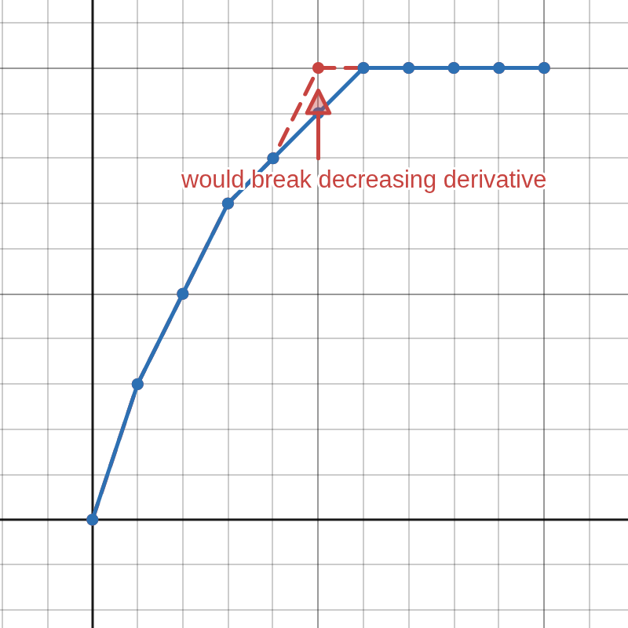
        <b>(a)</b> Cannot increment this one. 
    

    

        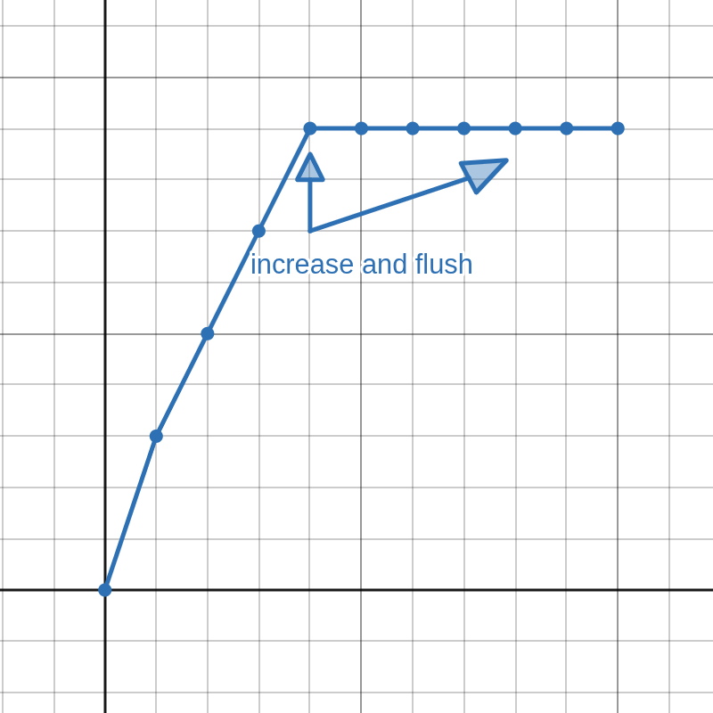
        <b>(b)</b> Have to increment from the left and flush. 
    

    

    	<b>Figure 5:</b> Since we cannot increment the point shown in (a), we must find where the derivative changes. In this case, the leftmost point with the same derivative is the next one on the left, so increment/flush from there. 
    

5. If the first digit equals `BASE`, then we are done. Otherwise, go to Step 2. 

Code for generating next function in sequence is called `f_next()`, which can be found in `src/shared.h`. It has been verified to find all valid function tables by comparing it's generated sequence of function tables to the sequence of function tables generated by a naïve counter. 

The precision of the generated tables is horrific at this point. Not only our lookup table consists of small integers, but the derivative also decreases in discrete steps. As seen in Figure 6, This means that the second derivative would consist of large spikes at these steps and zeros otherwise, so we must smooth out the steps. 

    

        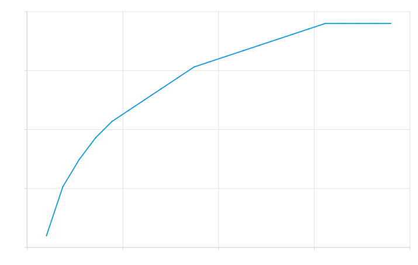
        <b>(a)</b> Generated arctan
    

    

        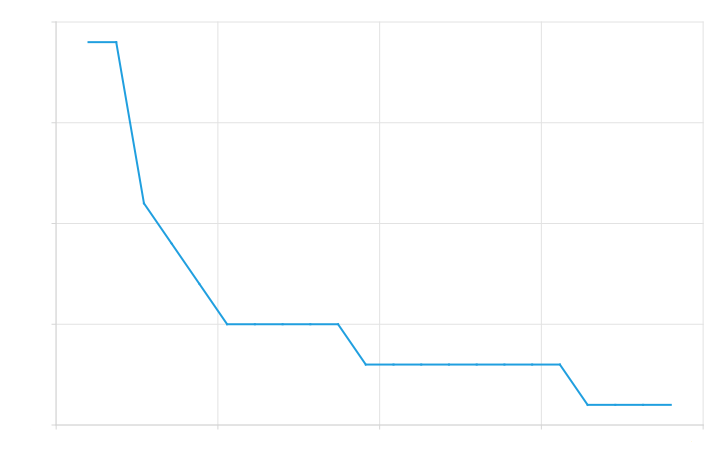
        <b>(b)</b> Generated derivative
    

    

        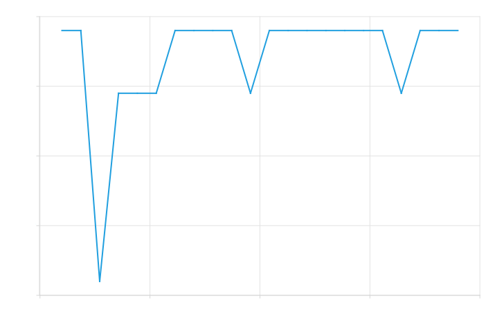
        <b>(c)</b> Generated second derivative
    

    

    	<b>Figure 6:</b> The generated unnormalized clipper (linearly interpolated) that most closely matched arctan (after filtering) in BASE=40. The counter's logic using discrete derivatives is clearly visible from the discrete steps seen in (b) and even in (a) to some extent. Taking the finite difference once more yields to a completely unusable second derivative seen in (c).
    

### Filter

To smooth out the discrete steps, we had to process the clipper lookup table with a smoothing filter. Before filtering, it is important to have the duplication of the positive side to the negative side done. The filtering had three major requirements: 

- Good step response: the filter should preserve the clippers overall shape (no ringing). 
- Good stopband attenuation: the derivatives are extremely sensitive to high frequencies. 
- Zero-phase: `f[0]` must stay at zero. This is only possible after duplicating positive side to negative side. 

The first two requirements are somewhat conflicting, but a good compromise was found by using three single pole IIR low-pass filters in series with a IIR coefficients $a_0 = 1/2$ and $b_1 = 1/2$. Being somewhat heavy handed with the filtering was justified by the fact than any clipper with hard edges could not be the softest, although we must be careful not to filter too much: this would make all generated clippers identical. Being single pole, the overall shape of the clipper was preserved well, and the multiple filters in series gave reasonably good attenuation at high frequencies. To keep it zero phase, the clipper would be duplicated, then both duplicates would be filtered, the first one from right to left, the other one from left to right. Then results were added together for the final zero-phase result. As an added bonus, being IIR, the infinite step response allows generating very good converging clippers. 

Any low-pass filter will ruin the first samples it processes, so we had to extrapolate our clippers. We chose to do quadratic extrapolation by finding the first and second differing samples from the edges to estimate first and second derivatives at the edges. This implicitly assumes non-zero first derivative, which unfortunately slightly reduced the generators capability to generate bounded clippers (a flat tail extrapolated to non-flat), but it considerably improved it's capability to generate converging and diverging clippers, so it was worth it. 

Figure 7 shows the generated unnormalized clipper in $\text{BASE}=40$ that matches $\arctan$ the most closely after filtering. The spikes in (c) are still visible, but the result does resemble the actual $\arctan''$ well enough. The clipper's data will not be modified further. We expect that comparing millions of generated functions will give us statistically correct results despite the spike-noise. 

    

        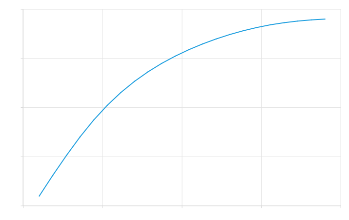
        <b>(a)</b> Generated arctan
    

    

        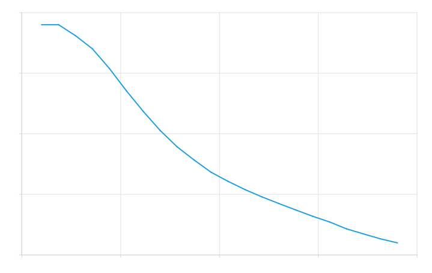
        <b>(b)</b> Generated derivative
    

    

        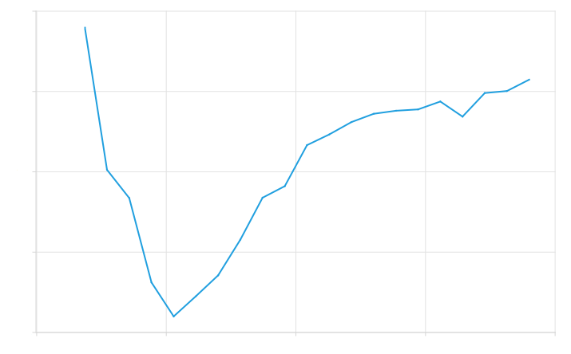
        <b>(c)</b> Generated second derivative
    

    

    	<b>Figure 7:</b> The generated clipper after filtering, linearly interpolated, that most closely matched arctan in BASE=40. Effects of the discrete derivatives are clearly significantly reduced. 
    

### Lookups

Input gain normalization uses $\sin(t) \in \R$ and output gain normalization uses $\text{probit}(t) \in \R,$ so the generated clipper lookup table must be able to handle real (floating point) inputs. Simple linear interpolation between samples was observed to be more accurate and computationally efficient than higher order splines. Inputs (especially from $\text{probit}$) could also get go out of bounds, so extrapolation was important as well. Linear extrapolation was not enough: it turned all clippers to diverging ones. Quadratic extrapolation more closely followed the overall shape the clipper. However, the parabola opening downwards on the positive side (and vice versa on the negative side) would break monotonicity if input amplitude exceeds the tip of the parabola. To fix this, we simply clamped the output beyond the tips. 

### Normalization

Input gain was normalized by finding the input gain value that matched our normalized THD value. We chose a value such that $A_{B\text{in}} \approx 1,$ which was about 2.22559 %. This is the upper limit where Blunter should be the softest. Lower values are also expected to make Blunter the smoothest, because in this range the sinusoid used for input gain normalization fully fits the polynomial section (no hard limiting). Higher values would favor diverging clippers since they have no hard limits. We observed that *secant method* gave us really good approximations very fast (less than three iterations on average). The Fourier series for the THD calculations were calculated using fixed point integers and pre-calculated tables of sines of frequencies of harmonics to improve computation speed. 

To find the good initial guesses for secant method, we plotted THD as a function of input gain (Figure 8) for a large number of generated clipper functions. The first guess would be simply the input gain that on average gives the normalized result, which we visually, from Figure 8 (b), concluded to be 0.6. For second guess, we noted that input gain cannot be negative because THD is calculated from squared coefficients. This allowed us to find a minimum point where $\text{THD} \approx 0,$ which is at $A_\text{in} \approx 0.3.$ Having our first evaluated value at the first guess and the average minimum point, we could create a secant line between the observed point and the minimum point to get the next estimate. 

    

        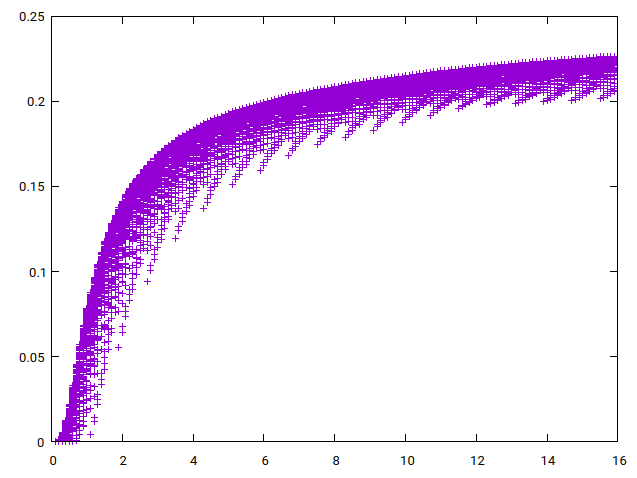
        <b>(a)</b> Zoomed out
    

    

        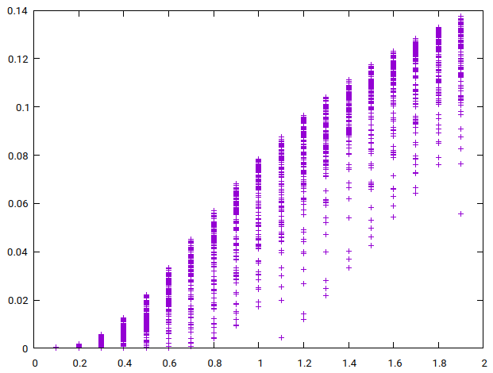
        <b>(b)</b> Zoomed in
    

    

    	<b>Figure 8:</b> THD as a function of input gain (in 0.1 sized steps). The wider view of (a) confirms that it is at least somewhat safe to consider THD to be monotonically increasing, so secant method is likely to not fail often due to local extrema. (b) shows that most generated clippers have a more or less linear region when input gain is roughly below 0.3, which we can use to estimate the second guess for the secant method. 
    

Output gain normalization was trivial using $\eqref{f_rms}$ and $\eqref{out_gain}$. The code uses `rms` and ignores DC since symmetric clippers does not produce DC. 

The filtered generator was tested by testing if it actually finds a diverging clipper, converging clipper, and a bounded clipper by finding the generated normalized functions with minimal absolute differences from the three functions in $\text{BASE}=40$. We chose $\text{arcsinh},$ a scaled and shifted *logistic function*, and of course the Blunter. The mean of all absolute differences was measured to be 0.1236 %, which will greatly improve further when increasing `BASE`. 

### Hardness

The final part was to compute the second derivative of the positive side using second finite difference of the clipper and find it's minimum (the second derivatives of the positive side are negative) value. It is important to not compute the second derivative from normalized lookups using $\eqref{hardness0}$: If $A_\text{in} > 1,$ then some adjacent samples will be taken from the same linear interpolation interval, which will result to zero second derivative (since taken from linear section) for these samples. If $A_\text{in} > 2,$ then this happens at least to every other sample completely ruining the second derivative. To accommodate for this, we must compute the second derivative using the second finite difference of the unnormalized table and scale the result using $\eqref{hardness}.$ 

### Results

For $\text{BASE} = 100,$ a total of 1 642 992 567 generated clippers were analyzed in four hours on Intel i7-8750H CPU @ 2.20 GHz (GPU was also used, but with very little performance gains due to the serial nature of the problem). The function with smallest hardness was the 98 581 013th generated function with a softness of approximately 0.382396. Then, a hard coded lookup table representing the Blunter was generated and it was compared against the found function. The mean of the absolute differences of lookups of normalized Blunter and the softest found was 0.00504009, which is 0.405966 % relative to normalized Blunter's highest value (which is also the Blunter's output gain normalization value since $B(1) = 1$). This confirms to a reasonable accuracy the softest function generated does in fact represent the Blunter. 

Hard coded Blunter's precise softness was measured to be approximately 0.405966, which is considerably higher than what was measured from the generated function. This is expected: our generator generated the functions based on low precision discrete derivatives and second derivatives. Even after filtering, these discrete steps would still show in the generated function as spikes, as seen before in Figure 6 and Figure 7. However, since Blunter has a constant second derivative, we expect to have many spikes in the second derivative that are spread out as evenly as possible. Figure 9 (c) shows the second derivative of the generated function, where you can clearly see these spikes. While they are indeed very evenly spread out, they will nonetheless increase the measured hardness. 

    

        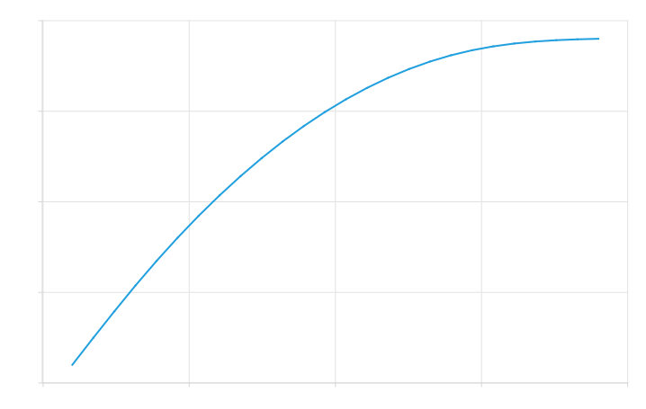
        <b>(a)</b> Softest generated clipper
    

    

        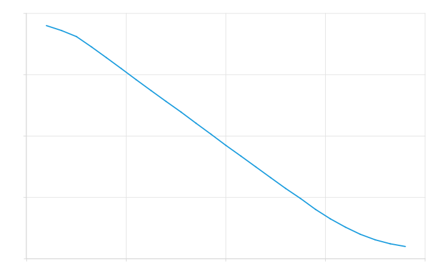
        <b>(b)</b> Generated derivative
    

    

        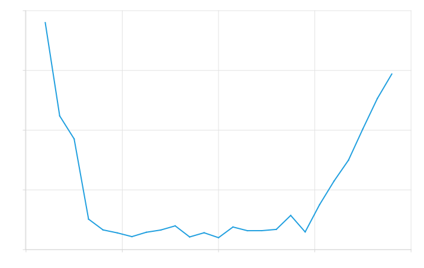
        <b>(c)</b> Generated second derivative
    

    

    	<b>Figure 9:</b> Softest generated clipper and it's derivatives. Since it was expected to match the Blunter, the first derivative was expected to have a somewhat linear section, and the second derivative was expected to have a somewhat constant section, which is what we observed (albeit a bit noisy). 
    

It is also worth noting that our generator made the function symmetric by fixing the zeroth element to zero and mirroring the function. This always gives zero second difference at $f[0],$ which is what we also see in the Figure 9 (c). Also, the IIR filtering would somewhat gradually decrease the magnitude of the second derivative to zero at the end of the generated domain. It should be noted that the second derivative is very sensitive to these sort of inaccuracies, but we got a reasonably good quality second derivatives and a very precise result anyway. 

## Comparing Hardness to WTHD Hardness

We can modify the previously described experiment to find the minimum WTHD hardness. Generating the functions, filtering them, and obtaining gain normalization values work the same, although output normalization can be ignored. However, to find how the hardness changes, we must repeatedly compute the Fourier series to obtain WTHD $\eqref{wthdf}$ and see how the WTHD changes. $b_n$ is now a function of $\alpha,$ a variable amplitude, so we have to use $\eqref{b_fn}$ instead of $\eqref{b_n}$. 

We estimated the derivative of HFC by incrementing $\alpha$ in 1/32 steps from $\alpha = 1/32$ to $\alpha = 1$ and computing the differences between adjacent HFC samples. Knowing that the 32 added Fourier series calculations would increase the computation time significantly, we decreased `BASE` to 80. 

We also wrote another program that compares how the second derivative based hardness relates to WTHD hardness. This was to make sure that these significantly different definitions of hardness do indeed measure roughly the same thing. It must be noted that the definitions are quite different, so some discrepancy is expected. 

### Results

A total of 123 223 638 functions were analyzed. The softest function was found at index 3 235 483 with a WTHD hardness of 0.288513. Again, this function was compared with the Blunter. Now the mean of the absolute differences between these functions was 0.0196245, which is 1.57308 % relative to normalized Blunter's highest value, so even with this very different definition of hardness, we still found the softest to be remarkably close to the Blunter. 

The program comparing the two different hardness definitions generated the plots seen in Figure 10. The first scatter plot (a) shows WTHD hardness versus hardness for every fourth generated clippers in $\text{BASE} = 60,$ which is 1 659 837 clippers. The plot is clearly very noisy, but this was expected. We already knew that the second derivative would be noisy. It was also expected that the low precision of $\alpha$ would also cause significant noise. Furthermore, the definitions of hardness and WTHD hardness are based on fundamentally differing principles. But despite the large amounts noise and the differing hardness definitions, it is still clear that they are somewhat closely related. Clearly increasing hardness increases WTHD hardness on average. 

The plot in Figure 10 (b) shows WTHD softness against softness for one hundred quadratic soft clippers $\eqref{qsoft}$ with knee size varying from 0.01 to 1 in 0.01 sized steps. As we can see, in the case of the quadratic soft clipper, both hardness definitions match extremely precisely. This emphasizes that the relationship between the definitions is real. 

    

        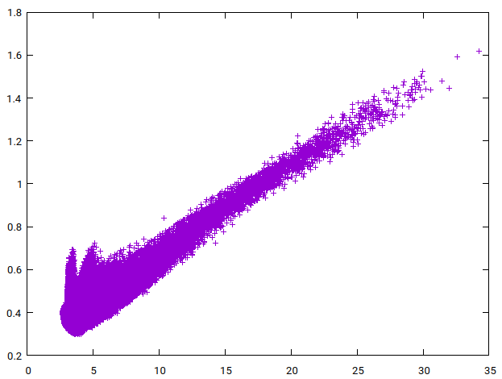
        <b>(a)</b> WTHD hardness vs hardness for practically all clippers 
    

    

        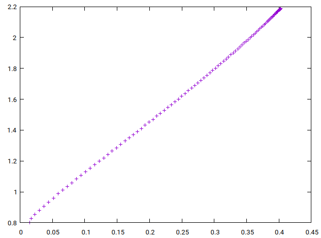
        <b>(b)</b> WTHD softness vs softness for quadratic soft clippers with varying knee size 
    

    

    	<b>Figure 10:</b> Comparison of our different hardness definitions. WTHD hardness is used on y-axis, hardness is used on x-axis. 
    

## Future Work

While it is expected that the constant second derivative makes the Blunter the softest for all THD normalization values below ours, our experiment only showed that this is the case in the upper limit. It is also expected that the Blunter is the softest clipper when including asymmetric clippers (if it is the softest on one side, why would the other one be any different?), but again, our experiment ignored those to keep computation times sensible. More experiments with different THD normalization values and asymmetric clippers are needed. 

We justified the simplification of simply using $\max$ by assuming that the sharpest edge of the clipping function would dominate the abruptness of change in harmonic content. However, $\max$ ignores all extrema other than the one with the highest magnitude. While we think that our assumption for the simplification is reasonable, it needs to be verified and potentially refined. 

Before implementing the main experiment, we did some rough subjective tests to see if it is worth to conduct the study to begin with. We found that the second derivative is potentially audible, so we moved further with the study. However, those preliminary tests were not rigorous at all, they were only conducted to make sure that there is anything meaningful to be studied in softness to begin with. This is why these preliminary tests were not discussed in this study. Much more rigorous subjective tests are needed to confirm if either, both, or neither softness definitions actually matches perceived softness in any way. 

## Conclusion

We presented a method to quantify and analyze clipping softness to address the lack of work that solely focus on clipping softness. We defined clipping hardness and softness mathematically and used the definition to analyze hard clipper and verified that it has zero softness following intuition. We then discussed how input and output gains are normalized in detail to enable meaningful comparisons of clippers. We also presented the Blunter, a quadratic soft clipper, which we claimed to be the softest clipper given our model. The claim was backed with an experiment that showed that if we generate all potential clippers and find the softest one, the generated softest clipper will in fact be the Blunter. Finally, we showed that hardness is related to WTHD hardness. 

## References

[^1]: Wilson, A., and B. M. Fazenda. ‘Profiling the Distortion Characteristics of Commercial Music Using Amplitude Distribution Statistics’, 2015.
[^2]:AUDIO CLIPPING DETECTION. *Patent*, issued August 2014. https://www.freepatentsonline.com/y2014/0226829.html.
[^3]: Wilson, Alex, and Bruno Fazenda. ‘Characterisation of Distortion Profiles in Relation to Audio Quality’, 09 2014. https://www.dafx14.fau.de/papers/dafx14_alex_wilson_categorisation_of_distort.pdf.
[^4]: Tan, Chin-Tuan, Brian Moore, and Nick Zacharov. ‘The Effect of Nonlinear Distortion on Perceived Quality of Music and Speech Signals’. *Journal of the Audio Engineering Society* 51 (11 2003): 1012–31. https://aes2.org/publications/elibrary-page/?id=12197
[^5]:Iii, Julius O. Smith. *Physical Audio Signal Processing: For Virtual Musical Instruments and Digital Audio Effects*. W3K Publishing, 12 2010. https://www.dsprelated.com/freebooks/pasp/Nonlinear_Distortion.html.
[^6]: Smith, Steven W. ‘The Scientist and Engineer’s Guide to Digital Signal Processing’, First., 19–23. California Technical Publishing, 1997. https://www.dspguide.com/ch2/4.htm.
[^7]: Box, George E. P., and Mervin E. Muller. ‘A Note on the Generation of Random Normal Deviates’. *Annals of Mathematical Statistics* 29 (1958): 610–11. https://api.semanticscholar.org/CorpusID:119971394.
[^8]: Metex. ‘Approximations Of The Inverse Error Function’. MIMIR GAMES, 6 2017. https://www.mimirgames.com/articles/programming/approximations-of-the-inverse-error-function/.
[^9]:Lauri Lorenzo Fiestas, . "Soft Clipper Analysis." (2026). https://github.com/PrinssiFiestas/soft-clipper-analysis
[^10]:"Klon Centaur Analysis." https://www.electrosmash.com/klon-centaur-analysis